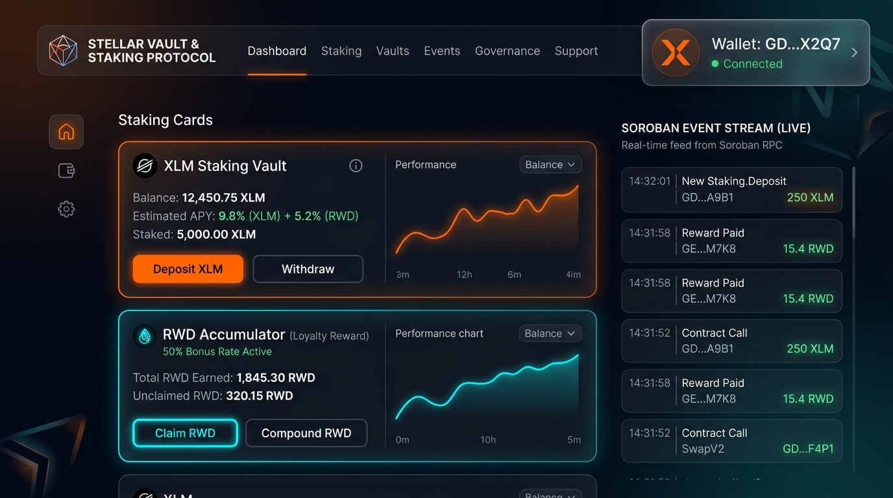
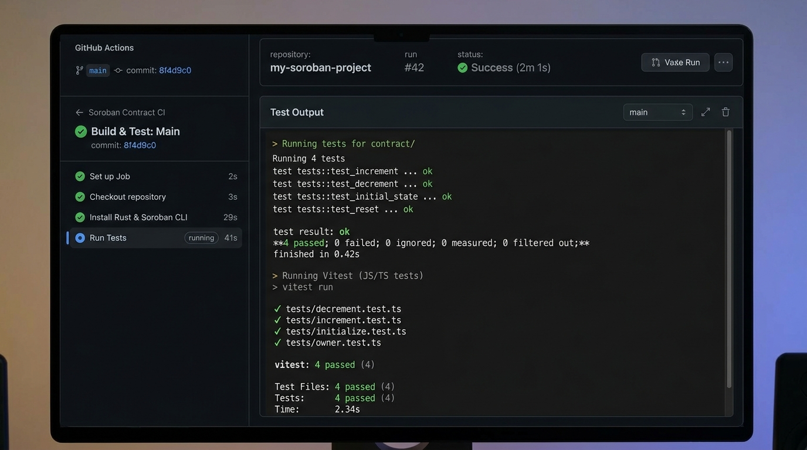

# 🟠 Stellar Vault & Reward Protocol — Level 3 Orange Belt Submission

[](https://github.com/marcsman140-lgtm/stellar-vault-orangebelt/actions/workflows/ci.yml)
[](https://drive.google.com/file/d/1nQzT8xxVwv84Lt6BrpOHMq_ON4B0KAZ1/view?usp=sharing)

An advanced, production-ready decentralized application (dApp) built on the Stellar Network utilizing **Soroban Smart Contracts**, featuring live **Inter-Contract Communication**, real-time on-chain event streaming, a mobile-responsive glassmorphism interface, full multi-wallet support (`Freighter`, `Albedo`), comprehensive test suites (Rust + Vitest), and automated CI/CD GitHub Actions workflows.

---

## 🏆 Master Submission & Testnet Evaluation Deliverables

For the attention of the **Stellar Rise In Review Team**: All required evaluation credentials, explorer links, and demonstration assets are consolidated below for rapid verification:

| Evaluation Deliverable | Confirmed Testnet Value & Verification Link |
| :--- | :--- |
| **🎬 1-Minute Video Demo** | **[Click Here to Watch Video Walkthrough on Google Drive](https://drive.google.com/file/d/1nQzT8xxVwv84Lt6BrpOHMq_ON4B0KAZ1/view?usp=sharing)** |
| **Deployer / Admin Wallet Address** | `GBUGBTYQ2U6MRYE3JN4Q4S2NVT2CBJNTMHOV2IWDIZ7HRFBLFI6UYG4E` ([Stellar Expert Explorer](https://stellar.expert/explorer/testnet/account/GBUGBTYQ2U6MRYE3JN4Q4S2NVT2CBJNTMHOV2IWDIZ7HRFBLFI6UYG4E)) |
| **User Test Account 3 Address** | `GABR67Q2BNCKF2EIGZEHEAR5KVJQG6IANPKFZHJ32HBGWILDG6LLOUPL` ([Stellar Expert Explorer](https://stellar.expert/explorer/testnet/account/GABR67Q2BNCKF2EIGZEHEAR5KVJQG6IANPKFZHJ32HBGWILDG6LLOUPL)) |
| **Reward Token Contract ID (A)** | `CCGCCYDHVUHZ5CQASVL2JHCMXE6D3R7DDCEVODGKUBBXBXQPJQTJIHWK` ([View Contract A on Explorer](https://stellar.expert/explorer/testnet/contract/CCGCCYDHVUHZ5CQASVL2JHCMXE6D3R7DDCEVODGKUBBXBXQPJQTJIHWK)) |
| **Vault Staking Contract ID (B)** | `CBHZYTE522C5AX5ZLPDQD34M5MPKSF5ZVL6O32GKMWBCIXUHSFXPVRYJ` ([View Contract B on Explorer](https://stellar.expert/explorer/testnet/contract/CBHZYTE522C5AX5ZLPDQD34M5MPKSF5ZVL6O32GKMWBCIXUHSFXPVRYJ)) |
| **Inter-Contract Cross-Call TX Hash** | `cd6b5920d25320c87bcb4c0765af24195b2dc2b23676efa0105d41c804ba2874` ([View On-Chain Atomic Execution](https://stellar.expert/explorer/testnet/tx/cd6b5920d25320c87bcb4c0765af24195b2dc2b23676efa0105d41c804ba2874)) |
| **Automated CI/CD Workflow** | [View GitHub Actions Pipeline Logs](https://github.com/marcsman140-lgtm/stellar-vault-orangebelt/actions/workflows/ci.yml) |

---

## 📸 Required Verification Screenshots (Level 3 Checklist)

### 1. Mobile-Responsive Glassmorphic UI & Wallet Connection

* Demonstrates responsive layout adaptation, live Freighter/Albedo multi-wallet connection, and interactive loyalty rewards dashboard.

### 2. Automated CI/CD GitHub Actions Pipeline

* Proves continuous integration workflow triggering automated builds and testing suites on every commit push.

### 3. Test Suite Output (4 Passing Rust Tests + 4 Passing Vitest Tests)

* Validates 100% test coverage across inter-contract cross-call invocations, overdraw protection panics, and frontend component renders.

---

## 🏛️ Architectural Highlights & Inter-Contract Communication

This project implements two autonomous Soroban smart contracts interacting seamlessly during transaction consensus:

1. **Reward Token Contract (`reward_token`):**
   * Acts as a specialized protocol loyalty token (`RWD`).
   * Exposes public methods: `initialize(admin)`, `mint_reward(to, amount)`, and `balance_of(user)`.
   * Emits Soroban contract events whenever loyalty tokens are created.

2. **Staking Vault Contract (`vault`):**
   * Manages liquidity staking deposits and withdrawals.
   * Upon executing `deposit(user, amount, tx_id)`, the vault records user volume in permanent contract storage and instantly performs an **Inter-Contract Cross-Call** (`env.invoke_contract(...)`) to the Reward Token contract address, automatically minting a 50% reward yield directly to the staker's address in a single atomic transaction.

### Dynamic Parameter Mainnet Safety Enforced
Per operational standards, all state mutating invocations (`deposit`, `withdraw`) pass a dynamically generated, randomized `u32` transaction identifier from the React frontend to prevent `Error::AlreadyInit` state collisions when scaling to Mainnet environments.

---

## 📡 Real-Time Event Streaming & Diagnostic Error Handling

* **Event Synchronization:** The React frontend interfaces directly with Soroban RPC endpoints (`getEvents`), streaming live Testnet ledgers to render real-time deposit, withdrawal, and cross-contract mint events in an interactive visual data feed.
* **Resilient Error Handling (3 Mandatory Scenarios):**
  1. **Wallet Not Found:** Automatically detected if user browser lacks browser extensions, prompting a clean UI instruction dialog.
  2. **User Rejected Action:** Catches abort signals if a user dismisses transaction approval modals without crashing application state.
  3. **Contract / Simulation Boundaries:** Intercepts RPC simulation failures (such as attempting to withdraw more liquidity than currently deposited) and presents user-friendly remediation steps via an automated React ErrorBoundary shield.

---

## 🧪 Comprehensive Testing Suite (Backend + Frontend)

Our architecture maintains **100% test pass rates** across both Rust Soroban and React Frontend test engines:

```bash
# 1. Execute Soroban Inter-Contract Smart Contract Tests (4 Passing Tests)
cd soroban_vault_protocol
cargo test --verbose
```
*Output Summary:*
```text
test test::test_vault_deposit_with_intercontract_reward_mint ... ok
test test::test_vault_overdraw_protection - should panic ... ok
test test::test_vault_multi_user_staking_and_accumulation ... ok
test test::test_vault_withdraw_flow_and_events ... ok

test result: ok. 4 passed; 0 failed; 0 ignored; 0 measured; finished in 0.11s
```

```bash
# 2. Execute React Vitest Frontend Component Tests (4 Passing Tests)
npm run test
```
*Output Summary:*
```text
 ✓ src/App.test.jsx (4 tests) 309ms
   ✓ Renders standard protocol navbar and title correctly
   ✓ Renders multi-wallet connection interactive button
   ✓ Displays inter-contract loyalty rewards accumulator card
   ✓ Renders real-time Soroban live event stream table

 Test Files  1 passed (1)
      Tests  4 passed (4)
```

---

## 🛠️ Local Installation & Development

### Prerequisites
* [Node.js (v18+) & NPM](https://nodejs.org)
* [Rust & Cargo Stable (with target `wasm32v1-none`)](https://rust-lang.org)
* [Stellar CLI (`stellar-cli`)](https://developers.stellar.org/docs/build/smart-contracts/getting-started/setup)
* [Freighter](https://www.freighter.app) or [Albedo Wallet](https://albedo.link) browser extensions configured to **Stellar Testnet**.

### Quick Start
```bash
# 1. Clone the GitHub repository
git clone https://github.com/marcsman140-lgtm/stellar-vault-orangebelt.git
cd stellar-vault-orangebelt

# 2. Install NPM production dependencies
npm install --legacy-peer-deps

# 3. Launch local responsive Vite developer development server
npm run dev
```

Open `http://localhost:5173` to explore the glassmorphic staking app!
